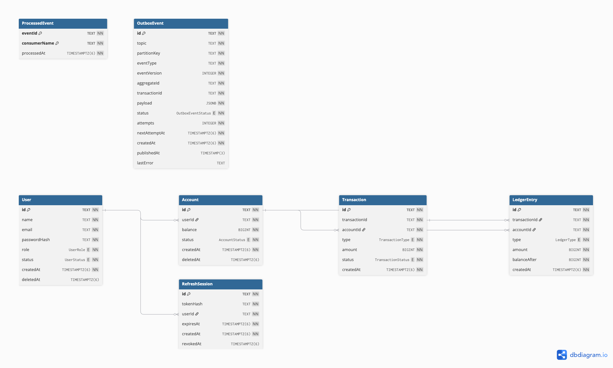

# Real-Time Banking Transaction Processing System

An Express + Bun + PostgreSQL + Kafka banking transaction service. The synchronous API validates and authorizes a transaction, locks the account row, updates the balance atomically, and writes an outbox event in the same database transaction. Kafka consumers then process the event asynchronously.

## Prerequisites

- Bun
- Docker and Docker Compose

## Local setup

```bash
bun install
cp .env.example .env
docker compose up -d
bun run prisma:migrate
bun run prisma:generate
bun run seed
bun run topics:create
```

For a deployed environment, use the committed migrations instead of creating
development migrations:

```bash
bun run prisma:deploy
bun run prisma:generate
```

Set a strong `JWT_ACCESS_SECRET` and a valid `ADMIN_PASSWORD` in `.env` before running the seed.

Start the API:

```bash
bun run dev
```

Run each worker in a separate terminal:

```bash
bun run worker:outbox
bun run worker:ledger
bun run worker:notification
bun run worker:analytics
bun run worker:fraud
bun run worker:finalization
```

Kafka UI is available at http://localhost:8081.

## API flow

All API routes use the `/api/v1` prefix.

1. Log in with `POST /api/v1/auth/login`.
2. Use the access token to create users and accounts.
3. Create a debit or credit with `POST /api/v1/transactions`.
4. Follow transaction updates with `GET /api/v1/transactions/:transactionId/events` (SSE).
5. Audit or replay with `GET /api/v1/replay/transactions/:transactionId` and
   `GET /api/v1/replay/accounts/:accountId`.
6. Admins can inspect persisted hourly metrics at `GET /api/v1/analytics`.

To observe `TransactionPending`, open the SSE stream first using the transaction ID you plan to submit.

Example transaction:

```json
{
  "transactionId": "txn_001",
  "accountId": "550e8400-e29b-41d4-a716-446655440000",
  "type": "DEBIT",
  "amountMinor": "12000",
  "deviceFingerprint": "device-demo"
}
```

Amounts are integer minor units. The transaction engine uses row locking and `transactionId` idempotency. Fraud rules run before the balance update; blocked transactions emit `TransactionBlocked` without changing the balance.

## Event flow

```text
Transaction API
  -> PostgreSQL transaction + OutboxEvent
  -> Outbox publisher
  -> banking.transaction-events.v1
  -> Ledger / Notification / Analytics / Async Fraud / Realtime consumers
  -> LedgerUpdated
  -> Finalization consumer
  -> TransactionFinalized
```

The transaction engine records `authorizedAt` in the same database transaction
as the balance change. Finalization requires both that authorization marker and
the idempotent `LedgerEntry`; if the ledger does not arrive before the timeout,
the finalization worker compensates the balance and emits
`TransactionCompensated`.

Each side-effect consumer has its own Kafka group and uses `ProcessedEvent` for idempotency. Failed messages are retried with exponential backoff and then written to `banking.transaction-events.v1.dlq`. The outbox publisher uses a processing lease so a crashed worker's events can be reclaimed.

Async fraud analysis persists device/IP observations in `FraudSignal` and sets
`Account.fraudFlaggedAt` after more than five observations in a rolling minute.
Analytics counters are persisted per UTC hour in `AnalyticsMetric`, so both
features survive worker restarts.

## Operational scripts

Reprocess messages from the DLQ:

```bash
bun run dlq:reprocess
```

Replay completed transaction events and rebuild balances:

```bash
bun run replay
bun run replay -- --account-id=<account-id>
bun run replay -- --transaction-id=<transaction-id>
```

Simulate a compromised credential sending ten ₹10,000 debits. The sixth and subsequent requests should be blocked by the velocity rule:

```bash
bun run simulate:attack -- <email> <password> <account-id>
```

With an account balance above ₹60,000 and all workers running, the expected
result is five successful requests followed by velocity/amount-blocked
requests, plus `asyncFraudFlagged: true` after the fraud consumer persists the
device/IP signal. Lower balances can produce `Insufficient balance` before the
fraud rule, so fund the account sufficiently when reproducing the simulation.
If the account was funded through the transaction API, wait 61 seconds before
starting the simulation so that funding transaction is outside the velocity
window.

### Observed simulation result

The recorded run against account `3702cf67-2ec7-456b-909b-8bc802b1e1cb` returned
four `201` responses and six `422` fraud blocks, with zero insufficient-balance
responses. The account had been credited approximately 12 seconds earlier, so
that credit counted as the first transaction in the five-transaction velocity
window. Only four attack debits could therefore complete; the fifth attack
request was the sixth transaction and was blocked. Subsequent blocked attempts
also exceeded the cumulative debit threshold.

The final balance was `6060000` minor units (₹60,600), confirming that only the
four successful ₹10,000 debits changed the balance. The same run reported
`asyncFraudFlagged: false` because the fraud consumer had not processed the
published events yet. Start `bun run worker:fraud` and query
`GET /api/v1/replay/accounts/3702cf67-2ec7-456b-909b-8bc802b1e1cb`; the worker
will consume the existing completed/blocked events, persist the device/IP
signals, and populate `fraudFlaggedAt`.

The replay endpoint for this run returned five balance-affecting events (one
funding credit and four successful debits) and rebuilt `6000000` minor units
(₹60,000). The ₹600 difference from the live balance is the account balance
that existed before this event history began; it was created outside the event
stream. For an exact regulatory rebuild, production account creation must emit
an opening-balance/genesis event, and all later balance changes must go through
the transactional outbox.

## Tests

```bash
bun run typecheck
bun run prisma:validate
bun test
```

The unit suite covers duplicate requests, concurrent debits, fraud blocking,
worker crash/retry, DLQ behavior, poison payload rejection, and event-based
balance rebuilding.

The Prisma schema is available at `prisma/schema.prisma`, and the DBML source
used to regenerate the diagram is at `docs/schema.dbml`.


